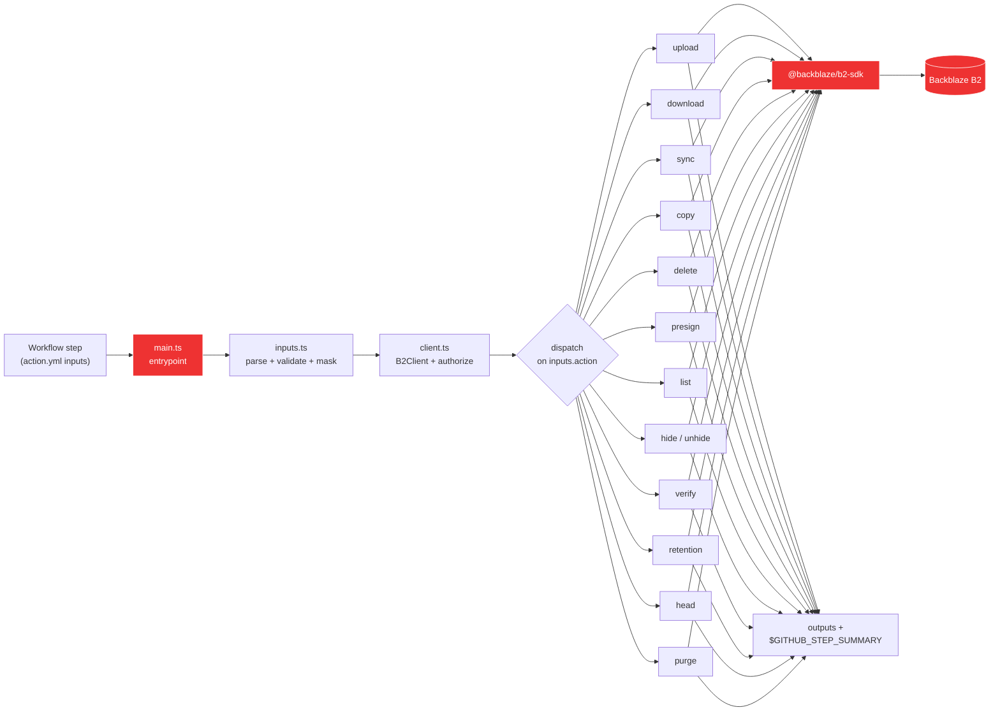

# Development

This document covers the internal architecture and local development workflow for the Action. If you're just using the action in your own workflows, the [README](./README.md) has everything you need. If you want to contribute, read this first, then jump to [CONTRIBUTING.md](./CONTRIBUTING.md) for the PR / release process.

## How it works



The action is a thin dispatcher. Every verb lands in [`@backblaze/b2-sdk`](https://github.com/backblaze/b2-sdk-typescript); we add input parsing, credential masking (`::add-mask::`), throttled progress logging, and step-summary rendering on top.

## Source layout

```
src/
  main.ts          # entrypoint: parse inputs, build client, dispatch, set outputs
  inputs.ts        # typed parser + validator for INPUT_* env vars
  client.ts        # B2Client factory + bucket resolver
  sse.ts           # SSE-B2 / SSE-C input parser
  progress.ts      # throttled progress listener
  summary.ts       # $GITHUB_STEP_SUMMARY writer
  version.ts       # VERSION constant (bumped in lockstep with package.json)
  commands/<verb>.ts  # one file per verb (13 today)
__tests__/
  _helpers.ts      # shared makeInputs() builder for command tests
  *.test.ts        # unit tests against the SDK's in-memory B2Simulator
.github/workflows/
  ci.yml                # lint, typecheck, test, coverage, build, dist freshness, actionlint, smoke
  release.yml           # tag-driven: gate + GitHub Release + floating major-tag move
  daily-smoke.yml       # 03:13 UTC: real-B2 end-to-end against the test bucket
  benchmark.yml         # weekly: this action vs Docker comparison
  example-*.yml         # 10 copy-paste workflows that double as integration tests
action.yml         # Marketplace manifest (inputs, outputs, branding)
dist/index.js      # ncc-bundled entrypoint (committed; CI fails if stale)
```

## Local commands

```bash
pnpm install        # also wires up git hooks (husky) — see below
pnpm lint           # biome check --error-on-warnings
pnpm lint:fix
pnpm typecheck      # tsc --noEmit (strict + exactOptionalPropertyTypes)
pnpm test           # vitest run — drives against the SDK's in-memory B2Simulator
pnpm test:coverage  # same + the 95/85/100/95 coverage gate
pnpm build          # ncc build src/main.ts -o dist
pnpm actionlint     # validate every workflow under .github/workflows/
pnpm all            # lint + typecheck + test + build
pnpm verify-dist    # build, then `git diff --exit-code dist/` (must be clean)
```

Requirements: Node 24+, pnpm 10+. The Action runs on Node 24 in the GitHub Actions runtime; CI tests Node 24 across Ubuntu / macOS / Windows.

## Git hooks

`pnpm install` runs `husky` (via the `prepare` script) which installs the hooks under [`.husky/`](./.husky/). Two hooks are active:

| Hook | What it runs | Triggers on |
|---|---|---|
| `pre-commit` | `pnpm lint` + `pnpm typecheck`. If `src/`, `package.json`, `tsconfig.json`, or `pnpm-lock.yaml` are staged: also `pnpm build` + a `dist/` freshness check that refuses the commit when rebuilt `dist/` differs from staged. If `.github/workflows/` or `.github/actions/` are staged: also `pnpm actionlint`. | Every `git commit` |
| `pre-push` | `pnpm test` + `pnpm test:coverage`. | Every `git push` |

The split keeps `pre-commit` under ~3 s on a clean repo by deferring the slower test run to `pre-push`. Skip either hook with `--no-verify` if you need to; the same checks run in CI.

`actionlint` is fetched into `node_modules/.cache/actionlint/` on first use and cached after. Override the version with `ACTIONLINT_VERSION=1.7.x pnpm actionlint`.

## Conventions

This repo mirrors the sibling [`b2-typescript-sdk`](https://github.com/backblaze/b2-sdk-typescript) style:

- Biome formatter / linter (2-space indent, single quotes, no semicolons, 100-char width). Run `pnpm lint:fix` before pushing.
- `exactOptionalPropertyTypes` is ON. Use conditional-spread (`...(v !== undefined ? { k: v } : {})`) rather than passing `undefined`.
- `verbatimModuleSyntax` is ON. Use `import type` for type-only imports.
- Internal relative imports use `.ts` extensions (`import { x } from './foo.ts'`), not `.js`.
- All source under `src/`. Tests under `__tests__/` so they don't ship in `dist/`.

## CI gates

Every PR runs:

| Job | What it checks |
|---|---|
| `test` (matrix: ubuntu/macos/windows) | typecheck + vitest unit suite |
| `lint` | biome `--error-on-warnings` |
| `coverage` | vitest with v8 coverage, threshold 95 % statements / 85 % branches / 100 % functions / 95 % lines |
| `build-and-check-dist` | ncc build, then `git diff dist/`. **Drift is a warning, not an error**, while the SDK is on `main`-tracking (see [Sibling-SDK CI scaffold](#sibling-sdk-ci-scaffold-temporary)). Bundle size is gated hard at 4 MiB. |
| `actionlint` | validates every workflow file under `.github/workflows/` |
| `self-smoke` | runs `node dist/index.js` with no inputs, expects the missing-input error |

Plus, the [example workflows](./.github/workflows/README.md) are the integration test suite — they run against a real B2 test bucket on every PR (skipping forks because secrets aren't available there). The bucket itself is set up as described in the next section.

## Test bucket setup

The example workflows + `daily-smoke.yml` + `benchmark.yml` all hit a real B2 bucket. The upstream project uses:

| Purpose | Bucket name | Required? |
|---|---|---|
| Main destination for almost every example | `backblaze-labs-b2-action-ci-tests` | yes |
| Source bucket for `example-cross-bucket-replicate.yml` | `backblaze-labs-b2-action-ci-tests-src` | optional |
| Object-Lock-enabled bucket for `example-scheduled-backup.yml` (retention test) | `backblaze-labs-b2-action-ci-tests-lock` | optional |

If you're forking and want to run the integration suite against your own B2 account, the bucket names don't matter — only the secret values do. The workflows resolve everything through `${{ secrets.B2_TEST_BUCKET }}` etc.

### B2-side configuration

Apply this to each bucket (the satellite ones get the same treatment as the main):

- **Type:** `allPrivate`. The workflows authenticate via the application key; public access isn't needed.
- **Lifecycle rule:** auto-hide and auto-delete after 1 day. Every workflow cleans up its own `<run-id>/` prefix in `if: always()` steps, but the lifecycle rule is belt-and-suspenders for the case where an aborted run leaves objects behind.
- **Object Lock:** **enabled only on `…-tests-lock`**. The `retention` verb requires `fileLockEnabled: true` at bucket creation time, which cannot be added later. Leave it off on the other two.

### Application key scope

Create one application key with these capabilities, scoped to the three buckets (or to "all buckets" if you prefer the simpler scope and accept the broader blast radius):

- `listBuckets`, `listFiles`, `readFiles`, `writeFiles`, `deleteFiles` — needed by `upload`, `download`, `sync`, `list`, `delete`, `copy`, `hide`, `unhide`, `purge`.
- `readFileRetentions`, `writeFileRetentions`, `readFileLegalHolds`, `writeFileLegalHolds` — needed by the `retention` example.
- `bypassGovernance` — only if you want the test that exercises shortening a governance retention.
- `shareFiles` — needed by `presign`.

### GitHub repo secrets

In `Settings → Secrets and variables → Actions`, set:

| Secret | Value |
|---|---|
| `B2_APPLICATION_KEY_ID` | The application key ID from the previous step. |
| `B2_APPLICATION_KEY` | The application key (this is shown once at creation — store it). |
| `B2_TEST_BUCKET` | `backblaze-labs-b2-action-ci-tests` (or your equivalent). |
| `B2_TEST_BUCKET_SRC` | `backblaze-labs-b2-action-ci-tests-src` (optional; unlocks `cross-bucket-replicate`). |
| `B2_TEST_BUCKET_LOCKED` | `backblaze-labs-b2-action-ci-tests-lock` (optional; unlocks `scheduled-backup`). |
| `B2_SSE_C_KEY_B64` | Optional base64-encoded 32-byte SSE-C key. If unset, the `sse-encryption` example generates a per-run key as fallback. |

Once those are in place, the example workflows trigger on every PR (other than forks, which can't see secrets) and the `daily-smoke.yml` cron runs nightly. There's no manual step beyond setting the secrets.

### Simulator vs real bucket — what each layer catches

- **Vitest + `B2Simulator`** (`pnpm test`): instant, deterministic, runs on every PR including forks. Validates the dispatcher, input parsing, error paths, and the SDK contract. Doesn't touch the network.
- **Example workflows** (`.github/workflows/example-*.yml`): real wire-protocol. Catches B2 API drift, auth quirks, and integration-layer regressions that the simulator can't see. Skips on forks (secrets-gated).

The redundancy is deliberate: the simulator suite is what guarantees a contributor's fork PR gets validated end-to-end before secrets-gated workflows run.

## Sibling-SDK CI scaffold (temporary)

Until [`@backblaze/b2-sdk`](https://github.com/backblaze-labs/b2-typescript-sdk) is published to npm, this repo's `package.json` references the SDK via `"@backblaze/b2-sdk": "link:../b2-typescript-sdk"`. That works locally because the SDK lives alongside this repo, but it's empty on a clean GitHub runner.

To unblock CI, a composite action at [`.github/actions/setup-sdk-sibling/`](./.github/actions/setup-sdk-sibling/action.yml) clones the SDK as a sibling and builds it before `pnpm install` runs in this repo. It uses a fine-grained PAT stored as `SDK_REPO_TOKEN`.

### SDK ref tracking + dist drift policy

The composite action's default `ref:` is **`main`** — every CI run rebuilds against the current SDK HEAD. Because the SDK is still in active development, every advance of SDK `main` changes the bundled bytes of `dist/index.js`, even when nothing in *this* repo changed.

To avoid blocking every PR with a "dist out of sync" error, **`ci.yml`'s `build-and-check-dist` job emits a *warning*, not an error**, when a fresh `pnpm build` produces a different `dist/` than what's committed. The warning is surfaced both in the job log and in the run's step summary.

The `release.yml` workflow's equivalent check **stays strict** — releases must ship with `dist/` built against the SDK ref they're tagged at. Before tagging a release:

1. `cd ../b2-typescript-sdk && git pull` (or check out the specific SDK ref you're releasing against).
2. `cd ../b2-action && pnpm build`.
3. `git add dist/ && git commit -m "build: regenerate dist/ for vX.Y.Z"`.
4. Tag and push.

Once the SDK publishes to npm, pin a version range in `package.json`, restore `build-and-check-dist` to hard-failing, and delete this whole scaffold.

### SDK simulator gaps (testing implications)

Coverage currently sits at ~97.8 % statements / ~90 % branches. The gap to 100 % is mostly **branches that depend on SDK response shapes the `B2Simulator` doesn't yet emit** under the patterns our action uses. Rather than mock around them with `vi.spyOn` (and end up testing the mocks rather than our code), we've deferred these tests until the SDK is updated.

Branches currently uncovered and waiting on the SDK:

| File | Branch | What we need from the simulator |
|---|---|---|
| `delete.ts`, `purge.ts` | `error` event from `deleteAll` | The simulator should emit `{ type: 'error' }` when a `deleteFileVersion` call inside `deleteAll` fails (e.g. missing fileId, retention-blocked). |
| `list.ts`, `download.ts`, `presign.ts` | Multi-page pagination | The simulator should set `nextFileName` on `listFileNames` responses when results exceed the requested `maxFileCount`. Today it returns everything in one page regardless of `maxFileCount`. |
| `download.ts`, `list.ts` | `f.action !== 'upload'` filter | The simulator's `listFileNames` should return hide markers (`action: 'hide'`) for files that have been hidden via `bucket.hideFile`, matching real-B2 behavior. |
| `verify.ts`, `download.ts` | `contentSha1: null` (multipart) | The simulator should report `null` content-SHA-1 on files finished via `b2_finish_large_file`, matching real-B2 multipart semantics. |
| `sync.ts` | `delete-remote` event case | The `synchronize` engine should emit `delete-remote` (not `hide`) when `keep-mode: delete` orphan removal hits a file with only one version. Currently emits `hide` regardless. |

We track these as known simulator gaps rather than chase 100 % with mocks. **When the SDK ships any of the above**, the corresponding test goes back into `__tests__/coverage-100.test.ts` driven by real simulator behavior.

A handful of remaining gaps are not simulator-related; they're TypeScript-mandated branches with one unreachable side (defensive `?? null` on type-guaranteed-number values, conditional spreads). Those will be `v8 ignore`'d in source rather than tested.

### Wiring

Only two workflows need this — the ones that actually run `pnpm install` and `pnpm build`:

| Workflow | Uses the scaffold? |
|---|---|
| `ci.yml` | Yes (every job: test, coverage, lint, build-and-check-dist) |
| `release.yml` | Yes |
| `daily-smoke.yml` | No — `actions/checkout` + `uses: ./` is enough; the action reads from committed `dist/`. |
| `benchmark.yml` | No — same reason as daily-smoke. |
| All 10 `example-*.yml` | No — same reason. |

### What the PAT needs

A fine-grained Personal Access Token, owner `backblaze-labs`, scoped to *only* the SDK repository, with **`Contents: Read`** and nothing else. Stored as the `SDK_REPO_TOKEN` repository secret.

### How to remove this scaffold

Once `@backblaze/b2-sdk` is published to npm:

1. Edit `package.json` and replace `"@backblaze/b2-sdk": "link:../b2-typescript-sdk"` with a real version range, e.g. `"@backblaze/b2-sdk": "^X.Y.Z"`.
2. Re-run `pnpm install` locally so `pnpm-lock.yaml` updates.
3. Delete the `.github/actions/setup-sdk-sibling/` directory.
4. Remove every `uses: ./.github/actions/setup-sdk-sibling` block from `.github/workflows/ci.yml` and `.github/workflows/release.yml` (search for `TODO(sdk-published)` to find them).
5. Delete the `SDK_REPO_TOKEN` secret from the repo settings.
6. Commit.

The composite action's own docstring repeats this checklist so future maintainers can find it without grepping.

## Step-by-step: adding a new verb

The pattern is the same every time:

1. **Implement** in `src/commands/<verb>.ts` exporting an async `xxxCommand(bucket, inputs)` (or `(client, bucket, inputs)` if you need the `B2Client` directly, like `presign` and `copy`).
2. **Register** the verb in `src/inputs.ts` — add to the `ActionName` type and `VALID_ACTIONS` array.
3. **Dispatch** in `src/main.ts` — switch case that maps the typed result to `core.setOutput(...)` and `writeStepSummary({...})`.
4. **Document** in `action.yml` — any new inputs and outputs the verb introduces.
5. **Test** under `__tests__/commands/<verb>.test.ts` — use `makeInputs(action, override)` from `_helpers.ts` and the SDK's `B2Simulator`. Cover happy path + at least one error.
6. **Example workflow** at `.github/workflows/example-<verb>.yml` — copy-paste-runnable AND acts as a live integration test against the project's test bucket.
7. **README + CHANGELOG** — add a row to the verb table, a usage snippet, and an `[Unreleased]` CHANGELOG entry.
8. **Rebuild** `dist/index.js` with `pnpm build` and commit it.

The deeper "how to contribute" workflow (PR process, release flow, release tags) lives in [CONTRIBUTING.md](./CONTRIBUTING.md).

## Why ncc, not Vite

The sibling SDK uses Vite library mode because it ships to npm with subpath exports. A GitHub Action is the opposite shape: one CJS-bundled `dist/index.js` that GitHub executes directly. `@vercel/ncc` is the standard `actions/typescript-action` tool for this — it produces a single bundle, sourcemaps, tree-shakes deps, and handles the dynamic `await import('node:fs/promises')` calls the SDK's sync engine uses for lazy `node:fs` loading in browser-isomorphic code.

## Why `dist/` is committed

GitHub Actions runs the action's `main:` entrypoint directly from the repo — there's no `npm install` step at usage time. So `dist/index.js` must be checked in. CI's `build-and-check-dist` job rebuilds and `git diff --exit-code dist/` to guarantee the committed bundle matches `src/`. Always run `pnpm build` before opening a PR that changes anything under `src/`.

## Bundle-size budget

`dist/index.js` is gated at **4 MiB** in CI. The SDK has zero runtime deps, so the current bundle sits comfortably at ~2.3 MiB; the budget exists to force a deliberate decision (in the PR) before any dependency that would push it over.

## User-Agent contract

The SDK builds a User-Agent of the form:

```
b2-sdk-ts/<sdk-version> (typescript; @backblaze/b2-sdk; <runtime>; <os>; <arch>) b2-github-action/<action-version>
```

We append the `b2-github-action/<v>` suffix so Backblaze's server-side logs can identify CI traffic originating from this Action. **Do not rename either the SDK's `b2-sdk-ts/` token or our `b2-github-action/` token** — both are stable product identifiers used for traffic analytics. The version constant is in [`src/version.ts`](./src/version.ts) and must be bumped in lockstep with `package.json` `version`.
