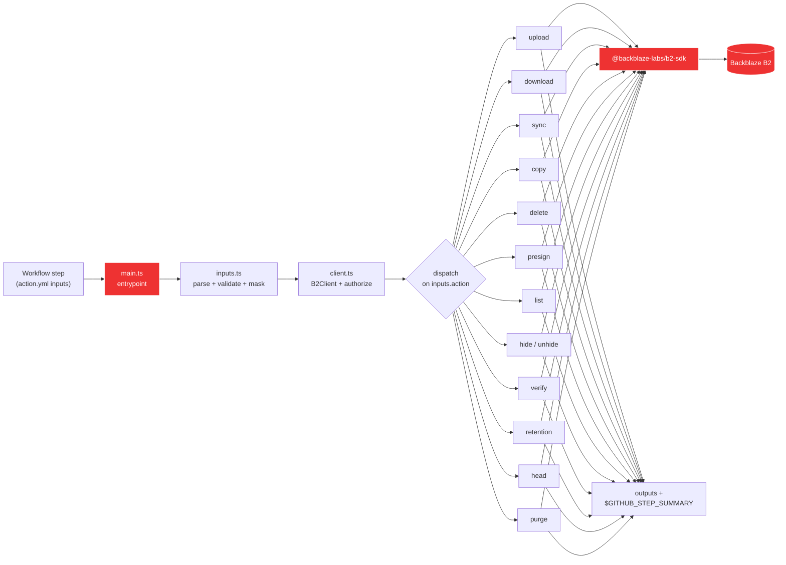

# Development

This document covers the internal architecture and local development workflow for the Action. If you're just using the action in your own workflows, the [README](./README.md) has everything you need. If you want to contribute, read this first, then jump to [CONTRIBUTING.md](./CONTRIBUTING.md) for the PR process and [RELEASE.md](./RELEASE.md) for the release process.

## How it works



The action is a thin dispatcher. Every verb lands in [`@backblaze-labs/b2-sdk`](https://github.com/backblaze-labs/b2-sdk-typescript); we add input parsing, credential masking (`::add-mask::`), throttled progress logging, and step-summary rendering on top.

## Source layout

```text
src/
  main.ts          # entrypoint: parse inputs, build client, dispatch, set outputs
  inputs.ts        # typed parser + validator for INPUT_* env vars
  client.ts        # B2Client factory + bucket resolver
  sse.ts           # SSE-B2 / SSE-C input parser
  progress.ts      # throttled progress listener
  summary.ts       # $GITHUB_STEP_SUMMARY writer
  version.ts       # VERSION constant (bumped in lockstep with package.json)
  commands/<verb>.ts  # one file per verb (13 today)
__tests__/
  _helpers.ts      # shared makeInputs() builder for command tests
  *.test.ts        # unit tests against the SDK's in-memory B2Simulator
.github/workflows/
  ci.yml                # lint, typecheck, test, coverage, build, dist freshness, smoke
  security.yml          # shared GitHub Actions workflow security checks
  codeql.yml            # CodeQL (SAST) static analysis of the TypeScript source
  release.yml           # see RELEASE.md
  daily-smoke.yml       # 03:13 UTC: real-B2 end-to-end against the test bucket
  example-*.yml         # 12 copy-paste workflows that double as integration tests
action.yml         # Marketplace manifest (inputs, outputs, branding)
dist/index.js      # ncc-bundled entrypoint (committed; CI fails if stale)
```

## Local commands

```bash
pnpm install        # also wires up git hooks (husky): see below
pnpm lint           # biome check --error-on-warnings
pnpm lint:fix
pnpm typecheck      # tsc --noEmit (strict + exactOptionalPropertyTypes)
pnpm test           # vitest run: drives against the SDK's in-memory B2Simulator
pnpm test:coverage  # same + the 95/85/100/95 coverage gate
pnpm build          # ncc build src/main.ts -o dist
pnpm run audit      # pnpm audit --prod --audit-level high (CI gate; needs network)
pnpm spellcheck     # cspell across src/, __tests__/, *.md, *.yml, action.yml
pnpm all            # lint + typecheck + test + build + spellcheck
pnpm verify-dist    # build, then `git diff --exit-code dist/` (must be clean)
pnpm docs           # typedoc (strict): generates docs/ for GitHub Pages
pnpm docs:watch     # typedoc in watch mode for local authoring
pnpm docs:lint      # markdownlint-cli2 against **/*.md
pnpm docs:check-action-yml  # action.yml <> README sync check
```

Requirements: Node 24+, pnpm 10+. The Action runs on Node 24 in the GitHub Actions runtime; CI tests Node 24 across Ubuntu / macOS / Windows.

## Git hooks

`pnpm install` runs `husky` (via the `prepare` script) which installs the hooks under [`.husky/`](./.husky/). Two hooks are active:

| Hook | What it runs | Triggers on |
| --- | --- | --- |
| `pre-commit` | `pnpm lint` + `pnpm typecheck` + `pnpm test` + `pnpm build` + `dist/` freshness check + `pnpm spellcheck`. Every local code/doc check, every commit, no path-gating. | Every `git commit` |
| `pre-push` | `pnpm test:coverage` (subsumes plain `test`, so we don't double-run). | Every `git push` |

Pre-commit runs every repo-local code/doc check so a small change cannot skip an important local gate. On a clean repo this takes ~5 s. Skip either hook with `--no-verify` if you need to; the same checks run in CI.

GitHub Actions workflow security is centralized in [`.github/workflows/security.yml`](./.github/workflows/security.yml), which calls the shared `backblaze-labs/github-actions` composite action pinned to a commit SHA. The shared action owns actionlint, third-party action pin checks, and zizmor audits so this repo does not carry local copies of those scripts. With a sibling checkout of `../github-actions`, maintainers can still use the same shared tooling locally:

```bash
node ../github-actions/scripts/format-workflows.mjs --root . --write
node ../github-actions/scripts/check-action-pins.mjs --root . --fix
node ../github-actions/scripts/check-action-pins.mjs --root .
env ACTIONLINT_CACHE_DIR=/private/tmp/backblaze-actionlint bash ../github-actions/scripts/actionlint.sh
```

## Conventions

This repo mirrors the [`b2-sdk-typescript`](https://github.com/backblaze-labs/b2-sdk-typescript) style:

- Biome formatter / linter (2-space indent, single quotes, no semicolons, 100-char width). Run `pnpm lint:fix` before pushing.
- `exactOptionalPropertyTypes` is ON. Use conditional-spread (`...(v !== undefined ? { k: v } : {})`) rather than passing `undefined`.
- `verbatimModuleSyntax` is ON. Use `import type` for type-only imports.
- Internal relative imports use `.ts` extensions (`import { x } from './foo.ts'`), not `.js`.
- All source under `src/`. Tests under `__tests__/` so they don't ship in `dist/`.

## CI gates

Every PR runs:

| Job | What it checks |
| --- | --- |
| `test` (matrix: ubuntu/macos/windows) | typecheck + vitest unit suite |
| `lint` | biome `--error-on-warnings` |
| `coverage` | vitest with v8 coverage, threshold 95 % statements / 85 % branches / 100 % functions / 95 % lines |
| `build-and-check-dist` | ncc build, then `git diff --exit-code dist/`. **Drift fails CI**: rebuild with `pnpm build` and commit `dist/`. Bundle size is gated hard at 4 MiB. |
| `github-actions` ([security.yml](./.github/workflows/security.yml)) | runs the shared GitHub Actions security composite action against every workflow, including actionlint, third-party action pin checks, and zizmor audits (see [Pinning third-party actions](#pinning-third-party-actions)) |
| `self-smoke` | runs `node dist/index.js` with no inputs, expects the missing-input error |
| `analyze` ([codeql.yml](./.github/workflows/codeql.yml)) | CodeQL (SAST) over the TypeScript source (`build-mode: none`, no compile needed). Runs on PRs to `main`, push to `main`, and weekly; findings surface in the repo Security tab. |
| `audit` | `pnpm audit --prod --audit-level high`: fails on a high/critical advisory in a **production** dependency. Scoped to prod (not devDeps) so a dev-tool advisory can't block an unrelated PR; devDep updates are handled by Dependabot. CI calls the builtin `pnpm audit` directly (resolves against the lockfile, no install); `pnpm run audit` is the local-convenience equivalent. |
| `sync-check` ([docs-lint.yml](./.github/workflows/docs-lint.yml)) | every input/output in `action.yml` also appears in the README reference tables. Drift fails CI. |
| `markdownlint` ([docs-lint.yml](./.github/workflows/docs-lint.yml)) | prose-style consistency across `**/*.md`. Config in [`.markdownlint-cli2.jsonc`](./.markdownlint-cli2.jsonc). |
| `link-check` ([docs-lint.yml](./.github/workflows/docs-lint.yml)) | lychee runs in `--offline` mode against `**/*.md`; catches broken relative paths and anchor fragments. External URLs are not pinged. |
| `spellcheck` ([docs-lint.yml](./.github/workflows/docs-lint.yml)) | cspell across `**/*.ts`, `**/*.md`, `**/*.yml`, `action.yml`. Config in [`cspell.json`](./cspell.json); domain-specific words live in [`.cspell/project-words.txt`](./.cspell/project-words.txt). Add a word there when cspell flags a deliberate identifier. |
| `docs` ([docs.yml](./.github/workflows/docs.yml)) | TypeDoc with `treatWarningsAsErrors: true`; every export must have JSDoc. Published to GitHub Pages on push to `main`. |

Plus, the [example workflows](./.github/workflows/README.md) are the integration test suite: they run against a real B2 test bucket on every PR (skipping forks because secrets aren't available there). The bucket itself is set up as described in the next section.

### Pinning third-party actions

Every third-party action under `.github/workflows/` is pinned to a full commit SHA with a trailing exact-version comment (for example `uses: actions/checkout@<sha> # v6.0.2`), so a moved or compromised upstream tag cannot run in our CI or the `contents: write` release job. The comment names the precise release the SHA represents, so a reviewer can confirm it at a glance. Dependabot's `github-actions` updates bump the SHA and the comment together. When you add a workflow step, pin it the same way: resolve the tag with `gh api repos/<owner>/<repo>/commits/<tag> -q .sha` and add the `# vX.Y.Z` comment. The repo's own action is referenced as `uses: ./` and is not pinned. This is enforced automatically by [`.github/workflows/security.yml`](./.github/workflows/security.yml), which uses the shared `backblaze-labs/github-actions` composite action; an accidental regression to `@v1` (or a major-only comment) cannot merge.

## Test bucket setup

The example workflows + `daily-smoke.yml` all hit a real B2 bucket. The upstream project uses:

| Purpose | Bucket name | Required? |
| --- | --- | --- |
| Main destination for almost every example | `backblaze-labs-b2-action-ci-tests` | yes |
| Source bucket for `example-cross-bucket-replicate.yml` | `backblaze-labs-b2-action-ci-tests-src` | optional |
| Object-Lock-enabled bucket for `example-scheduled-backup.yml` (retention test) | `backblaze-labs-b2-action-ci-tests-lock` | optional |

If you're forking and want to run the integration suite against your own B2 account, the bucket names don't matter: only the secret values do. The workflows resolve everything through `${{ secrets.B2_TEST_BUCKET }}` etc.

### B2-side configuration

Apply this to each bucket (the satellite ones get the same treatment as the main):

- **Type:** `allPrivate`. The workflows authenticate via the application key; public access isn't needed.
- **Lifecycle rule:** auto-hide and auto-delete after 1 day. Every workflow cleans up its own `<run-id>/` prefix in `if: always()` steps, but the lifecycle rule is belt-and-suspenders for the case where an aborted run leaves objects behind.
- **Object Lock:** **enabled only on `…-tests-lock`**. The `retention` verb requires `fileLockEnabled: true` at bucket creation time, which cannot be added later. Leave it off on the other two.

### Application key scope

Create one application key with these capabilities, scoped to the three buckets (or to "all buckets" if you prefer the simpler scope and accept the broader blast radius):

- `listBuckets`, `listFiles`, `readFiles`, `writeFiles`, `deleteFiles`: needed by `upload`, `download`, `sync`, `list`, `delete`, `copy`, `hide`, `unhide`, `purge`.
- `readFileRetentions`, `writeFileRetentions`, `readFileLegalHolds`, `writeFileLegalHolds`: needed by the `retention` example.
- `bypassGovernance`: only if you want the test that exercises shortening a governance retention.
- `shareFiles`: needed by `presign`.

### GitHub repo secrets

In `Settings → Secrets and variables → Actions`, set:

| Secret | Value |
| --- | --- |
| `B2_APPLICATION_KEY_ID` | The application key ID from the previous step. |
| `B2_APPLICATION_KEY` | The application key (this is shown once at creation: store it). |
| `B2_TEST_BUCKET` | `backblaze-labs-b2-action-ci-tests` (or your equivalent). |
| `B2_TEST_BUCKET_SRC` | `backblaze-labs-b2-action-ci-tests-src` (optional; unlocks `cross-bucket-replicate`). |
| `B2_TEST_BUCKET_LOCKED` | `backblaze-labs-b2-action-ci-tests-lock` (optional; unlocks `scheduled-backup`). |
| `B2_SSE_C_KEY_B64` | Optional base64-encoded 32-byte SSE-C key. If unset, the `sse-encryption` example generates a per-run key as fallback. |

Once those are in place, the example workflows trigger on every PR (other than forks, which can't see secrets) and the `daily-smoke.yml` cron runs nightly. There's no manual step beyond setting the secrets.

### Simulator vs real bucket: what each layer catches

- **Vitest + `B2Simulator`** (`pnpm test`): instant, deterministic, runs on every PR including forks. Validates the dispatcher, input parsing, error paths, and the SDK contract. Doesn't touch the network.
- **Example workflows** (`.github/workflows/example-*.yml`): real wire-protocol. Catches B2 API drift, auth quirks, and integration-layer regressions that the simulator can't see. Skips on forks (secrets-gated).

The redundancy is deliberate: the simulator suite is what guarantees a contributor's fork PR gets validated end-to-end before secrets-gated workflows run.

## Coverage

Coverage is at **100 % statements / 100 % branches / 100 % functions / 100 % lines** across 156 tests. Zero `v8 ignore` annotations in `src/`. Every uncovered branch the SDK formerly exposed (multipart `contentSha1: null`, pagination handover, `delete-remote` on unversioned buckets, `error` events from `deleteAll`, `bucket.head()` shape, `pageSize` rename, `SyncEvent` narrowing) shipped in the SDK and the action's tests drive them against real simulator behavior. If you add a new code path, add a real test for it; do not introduce a `v8 ignore` without a documented external reason.

## Step-by-step: adding a new verb

The pattern is the same every time:

1. **Implement** in `src/commands/<verb>.ts` exporting an async `xxxCommand(bucket, inputs)` (or `(client, bucket, inputs)` if you need the `B2Client` directly, like `presign` and `copy`).
2. **Register** the verb in `src/inputs.ts`: add to the `ActionName` type and `VALID_ACTIONS` array.
3. **Dispatch** in `src/main.ts`: switch case that maps the typed result to `core.setOutput(...)` and `writeStepSummary({...})`.
4. **Document** in `action.yml`: any new inputs and outputs the verb introduces.
5. **Test** under `__tests__/commands/<verb>.test.ts`: use `makeInputs(action, override)` from `_helpers.ts` and the SDK's `B2Simulator`. Cover happy path + at least one error.
6. **Example workflow** at `.github/workflows/example-<verb>.yml`: copy-paste-runnable AND acts as a live integration test against the project's test bucket.
7. **README + CHANGELOG**: add a row to the verb table, a usage snippet, and an `[Unreleased]` CHANGELOG entry.
8. **Rebuild** `dist/index.js` with `pnpm build` and commit it.

The deeper "how to contribute" workflow lives in [CONTRIBUTING.md](./CONTRIBUTING.md); the release runbook is in [RELEASE.md](./RELEASE.md).

## Why ncc, not Vite

The sibling SDK uses Vite library mode because it ships to npm with subpath exports. A GitHub Action is the opposite shape: one CJS-bundled `dist/index.js` that GitHub executes directly. `@vercel/ncc` is the standard `actions/typescript-action` tool for this: it produces a single bundle, sourcemaps, tree-shakes deps, and handles the dynamic `await import('node:fs/promises')` calls the SDK's sync engine uses for lazy `node:fs` loading in browser-isomorphic code.

## Why `dist/` is committed

GitHub Actions runs the action's `main:` entrypoint directly from the repo: there's no `npm install` step at usage time. So `dist/index.js` must be checked in. CI's `build-and-check-dist` job rebuilds and `git diff --exit-code dist/` to guarantee the committed bundle matches `src/`. Always run `pnpm build` before opening a PR that changes anything under `src/`.

## Bundle-size budget

`dist/index.js` is gated at **4 MiB** in CI. The SDK has zero runtime deps, so the current bundle sits comfortably under 1.5 MiB; the budget exists to force a deliberate decision (in the PR) before any dependency that would push it over.

## User-Agent contract

The SDK builds a User-Agent of the form:

```text
b2-sdk-typescript/<sdk-version> (typescript; @backblaze-labs/b2-sdk; <runtime>; <os>; <arch>) b2-github-action/<action-version>
```

We append the `b2-github-action/<v>` suffix so Backblaze's server-side logs can identify CI traffic originating from this Action. **Do not rename either the SDK's `b2-sdk-typescript/` token or our `b2-github-action/` token**: both are stable product identifiers used for traffic analytics. The version constant is in [`src/version.ts`](./src/version.ts) and must be bumped in lockstep with `package.json` `version`.
